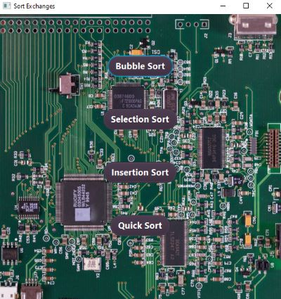
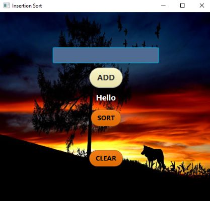
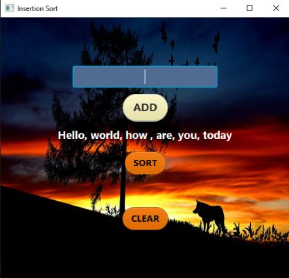
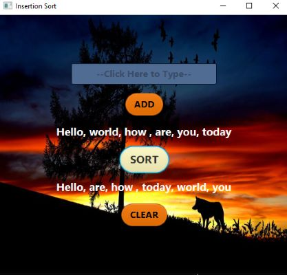
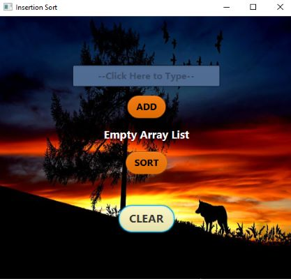
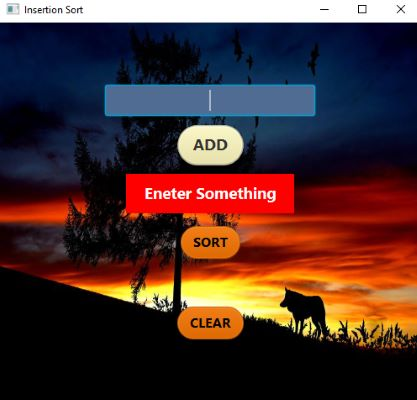

<h1 align="center">Welcome to Insertion Sorter</h1>

<!--  -->

<h4 align="center">
  Javafx: that takes an Array List using a selection sort algorithm.
  Type in a value then pressing the add button will append it to the
  array list.  The sort button will sort the array list.
</h4>
 

<h2 align="center" style="text-decoration: underline;">Using this GUI is as follows:</h2>

<h4 align="center">
    1. Click in text field area to type in something to add.  Pressing enter on the keyboard or clicking
    the ADD button will add the value to the array list.

  <!--  -->
</h4>

<h4 align="center">
    2. Click in the text box to start typing in a number.

  <!--  -->
</h4>

<h4 align="center">
    3. Repeat step 2 to add more items to the array list.  The array list will be displayed.

  <!--  -->
</h4>

<h4 align="center">
    4. After all the times have been added, press the sort button.  This program will use insertion sort to sort the array list.  The sorted array will be displayed.

  <!--  -->
</h4>

<h4 align="center">
    5. Pressing the CLEAR button will empty the array list allowing you to start over.

    <!--  -->
</h4>

<h2 align="center" style="text-decoration: underline;">Errors:</h2>

<h4 align="center">
    1. If the ADD button is pressed and the text field is empty, an error will be displayed.  Please type a item in the text field that you wish to add.

    <!--  -->
</h4>

<!-- For more details see [GitHub Flavored Markdown](https://guides.github.com/features/mastering-markdown/). -->
<!-- You can use the [editor on GitHub](https://github.com/zuki07/Insertion_sorter/edit/master/README.md) to maintain and preview the content for your website in Markdown files. -->
