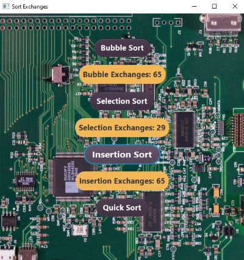

<h1 align="center">Welcome to Sorter Exchanges</h1>

<!--  -->

<h4 align="center">
  Javafx: clicking each sort button takes twenty two items from an array and sorts it.  Each sort uses the same values so the results will be accurate.  The program counts how many exchanges each sort takes.  This will determine which sort algorithm has less exchanges.
</h4>
 

<h2 align="center" style="text-decoration: underline;">Using this GUI is as follows:</h2>

<h4 align="center">
    1. Click on the Bubble Sort button and the amount of exchanges are displayed using twenty two items.

  <!--  -->
</h4>

<h4 align="center">
    2. Click on the Selection Sort button and the amount of exchanges are displayed using twenty two items.

  <!--  -->
</h4>

<h4 align="center">
    3. Click on the Insertion Sort button and the amount of exchanges are displayed using twenty two items.

  <!--  -->
</h4>

<h4 align="center">
    4. Click on the Quick Sort button and the amount of exchanges are displayed using twenty two items.

  <!--  -->
</h4>

<!-- For more details see [GitHub Flavored Markdown](https://guides.github.com/features/mastering-markdown/). -->
<!-- You can use the [editor on GitHub](https://github.com/zuki07/Insertion_sorter/edit/master/README.md) to maintain and preview the content for your website in Markdown files. -->
